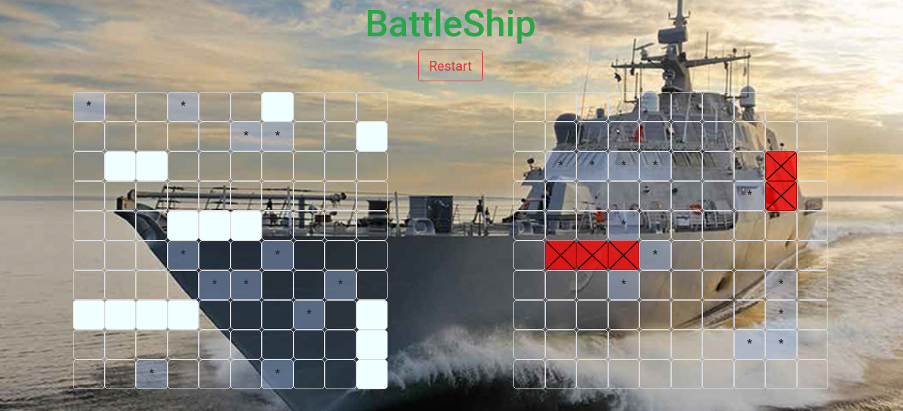

# Battleship

[](https://github.com/RichardLitt/standard-readme)


> This project is creted to brush up the core concepts of Callbacks, Object Oriented Programming, Factory Functions, Module Pattern, Single Responsibility, Tightly Coupled Objects and Test Driven Development using jest framework.

TODO: Battleship (also Battleships or Sea Battle1) is a strategy type guessing game. This game has been designed to play against a dummy device. Where each turn marks a grid of enemys board to destroy their placed ship. Who destroys all the ships in enemy's fleet is the winner.

## Table of Contents

- [Background](#background)
- [Install](#install)
- [Usage](#usage)
- [Maintainers](#maintainers)
- [Contributing](#contributing)
- [License](#license)

## Background
```
1. JavaScript
2. HTML CSS
3. Bootstrap
4. Jest
```
## Install

```
1. 1. Run `npm install` It will install all the dependencies required by the project.
```

## Usage

```
1. Clone the repository: `git@github.com:shshamim63/Battleship_Game.git`
2. Enter into the folder: `cd Battleship_Game`
3. Run `npm start` to start the development server. It will automatically open the page in your default browser.
4. Run `npm run build` to get a deployable version.
5. Run `npm run test` to execute the test cases.
```

## Maintainers

[Shakhawat Hossain](https://github.com/shshamim63)

## Contributing

PRs accepted.

Small note: If editing the README, please conform to the [standard-readme](https://github.com/RichardLitt/standard-readme) specification.

## License

MIT © 2019 Shakhawat Hossain
